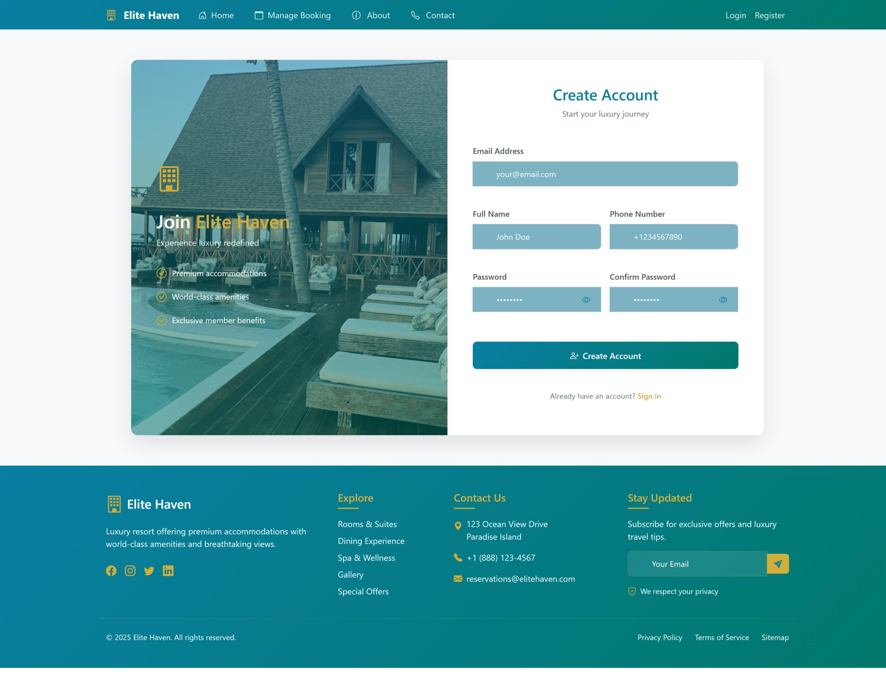

📌 Overview
Elite Haven is a premium villa booking platform that connects travelers with luxury accommodations worldwide. This ASP.NET Core MVC application provides a seamless booking experience with admin management capabilities.

✨ Key Features
🏡 Luxury villa listings with detailed descriptions

📅 Booking management system

  

🔐 Role-based authentication (Admin/Customer)

  

💳 Secure payment integration

  

📱 Responsive design for all devices

📊 Admin dashboard for property management

  

⭐ Customer reviews and ratings

  

🛠️ Technology Stack
Backend
ASP.NET Core 8.0 MVC

Entity Framework Core

Identity for Authentication

Repository Pattern with Unit of Work

Frontend
Bootstrap 5

JavaScript/jQuery

Font Awesome Icons

Toastr Notifications

Database
SQL Server

🚀 Getting Started
Prerequisites
.NET 8.0 SDK

Visual Studio 2022 or VS Code

SQL Server (LocalDB included with Visual Studio)
